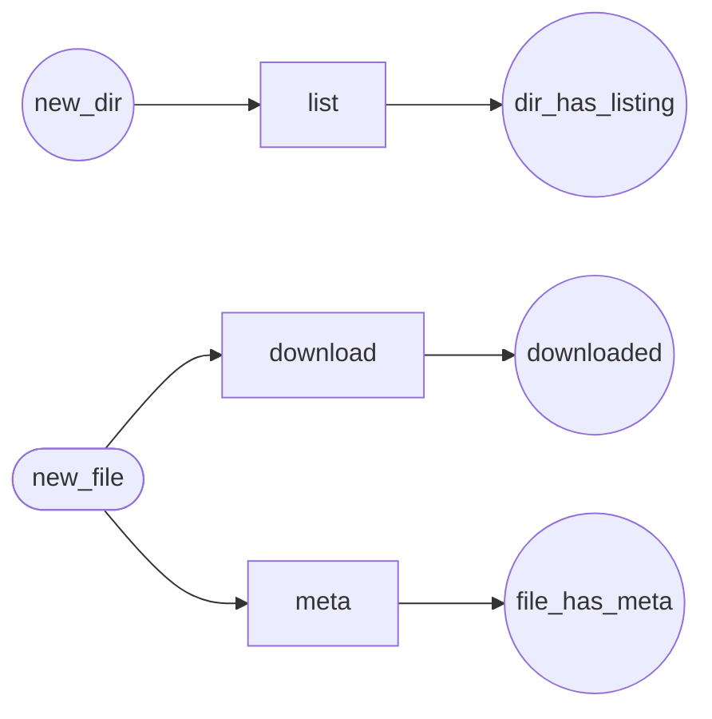

Workflow: FileWorkflow
======================

*Generated by `doc:workflows` on `2026-08-20T09:43:19+00:00`. Type: workflow.*

Diagram
-------



[High-resolution SVG](FileWorkflow.svg)

Places
------

* `new_dir`
* `new_file` *(initial)*
* `dir_has_listing`
* `downloaded`
* `file_has_meta`

Transitions
-----------

|Transition|From|To|
|:-|:-|:-|
|`list`|`new_dir`|`dir_has_listing`|
|`download`|`new_file`|`downloaded`|
|`meta`|`new_file`|`file_has_meta`|

Listeners
---------

*App listeners subscribed to this workflow's events, with source.*

### `App\Workflow\FileWorkflow::onGuardList()`

Events: `workflow.FileWorkflow.guard.list`

`src/Workflow/FileWorkflow.php` (L29–L35)

```php
public function onGuardList(GuardEvent $event): void
{
       $file = $this->getFile($event);
       if (!$file->isDir) {
           $event->setBlocked(true, "only directories can be listed");
       }
}
```

### `App\Workflow\FileWorkflow::onList()`

Events: `workflow.FileWorkflow.transition.list`

`src/Workflow/FileWorkflow.php` (L38–L44)

```php
public function onList(TransitionEvent $event): void
{
       $file = $this->getFile($event);
       $results = $this->storageService->syncDirectoryListing($file->storageId, $file->path);
       $this->storageService->dispatchDirectoryRequests($results);
   }
```