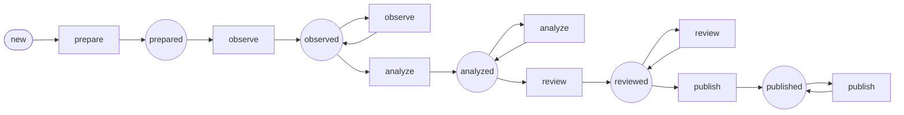

Workflow: ai_subject
====================

*Generated by `doc:workflows` on `2026-08-17T18:12:07+00:00`. Type: workflow.*

Diagram
-------

[High-resolution SVG](ai_subject.svg)

Places
------

* `new` *(initial)* — The subject exists but has not been prepared for AI work.
* `prepared` — Source content, metadata, URLs, or normalized text are available for observation.
* `observed` — Observation has produced neutral evidence. Additional observation tasks may still be queued on the subject.
* `analyzed` — Application-level interpretation has been derived from observed evidence and context.
* `reviewed` — Analysis has passed app-defined review, whether automatic policy checks or human approval.
* `published` — Analysis has been projected into app fields, indexes, exports, webhooks, or other public outputs.

Transitions
-----------

|Transition|From|To|
|:-|:-|:-|
|`prepare`|`new`|`prepared`|
|`observe`|`prepared`|`observed`|
|`observe`|`observed`|`observed`|
|`analyze`|`observed`|`analyzed`|
|`analyze`|`analyzed`|`analyzed`|
|`review`|`analyzed`|`reviewed`|
|`review`|`reviewed`|`reviewed`|
|`publish`|`reviewed`|`published`|
|`publish`|`published`|`published`|