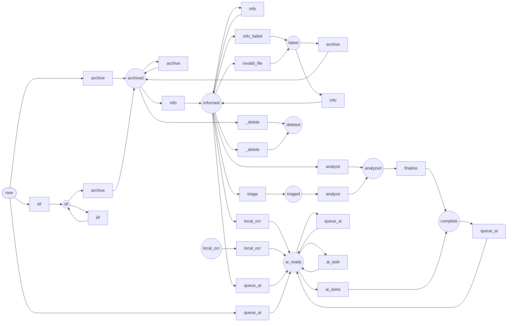

Workflow: asset
===============

*Generated by `doc:workflows` on `2026-08-17T18:12:07+00:00`. Type: workflow.*

Diagram
-------



[High-resolution SVG](asset.svg)

Places
------

* `new` *(initial)* — Registered/added
* `iiif` — Registered/added
* `archived` — Source master streamed into our S3 (museado). imgproxy reads it via s3://.
* `informed` — imgproxy /info fetched: dimensions, byte size, format, hash from s3:// source.
* `triaged` — Triage observations recorded (caption, ocr_text, keywords from ai-tools /v1/responses)
* `local_ocr` — Ocr/confidence from local Tesseract
* `analyzed` — Features computed (blurhash/palette/pHash/probe)
* `complete` — All done
* `ai_ready` — AI task pipeline active — aiQueue has pending tasks
* `failed` — Terminal error / exhausted retries
* `deleted` — Asset + its archive object deleted (terminal). Set immediately before row removal.

Transitions
-----------

|Transition|From|To|
|:-|:-|:-|
|`archive`|`new`|`archived`|
|`archive`|`iiif`|`archived`|
|`archive`|`archived`|`archived`|
|`archive`|`failed`|`archived`|
|`info`|`archived`|`informed`|
|`info`|`informed`|`informed`|
|`info`|`failed`|`informed`|
|`_delete`|`archived`|`deleted`|
|`_delete`|`informed`|`deleted`|
|`local_ocr`|`informed`|`ai_ready`|
|`local_ocr`|`local_ocr`|`ai_ready`|
|`iiif`|`new`|`iiif`|
|`iiif`|`iiif`|`iiif`|
|`info_failed`|`informed`|`failed`|
|`invalid_file`|`informed`|`failed`|
|`triage`|`informed`|`triaged`|
|`analyze`|`informed`|`analyzed`|
|`analyze`|`triaged`|`analyzed`|
|`finalize`|`analyzed`|`complete`|
|`queue_ai`|`complete`|`ai_ready`|
|`queue_ai`|`informed`|`ai_ready`|
|`queue_ai`|`ai_ready`|`ai_ready`|
|`queue_ai`|`new`|`ai_ready`|
|`ai_task`|`ai_ready`|`ai_ready`|
|`ai_done`|`ai_ready`|`complete`|

Listeners
---------

*App listeners subscribed to this workflow's events, with source.*

### `App\Workflow\AssetWorkflow::onAiTask()`

Events: `workflow.asset.transition.ai_task`

`src/Workflow/AssetWorkflow.php` (L221–L226)

```php
public function onAiTask(TransitionEvent $event): void
{
    $asset = $this->getAsset($event);
    $this->runNextAiTask($asset);
    $this->em->flush();
}
```

### `App\Workflow\AssetWorkflow::onArchive()`

Events: `workflow.asset.transition.archive`

`src/Workflow/AssetWorkflow.php` (L513–L634)

```php
public function onArchive(TransitionEvent $event): void
{
    $asset = $this->getAsset($event);
    if ($this->archiveStorage === null) {
        throw new RuntimeException('archiveStorage (museado) is not configured.');
    }
    // Already in our bucket? (e.g. old-pipeline assets under orig/, or a prior
    // run). Reuse the existing object — no re-download, no re-upload. /info
    // then runs against s3://museado/{storageKey} as usual.
    if (is_string($asset->storageKey) && $asset->storageKey !== ''
        && $this->archiveStorage->fileExists($asset->storageKey)
    ) {
        $asset->storageBackend ??= 'archive';
        $asset->archiveUrl ??= $this->assetRegistry->s3Url($asset);
        $asset->statusCode = 200;
        $this->logger->info('archive[{id}]: already in bucket → reuse {key} (no download, no upload)', [
            'id' => $asset->id,
            'key' => $asset->storageKey,
        ]);
        $this->em->flush();
        $this->warmThumbnailCache($asset);
        return;
    }
    $url = $asset->originalUrl;
    // Stream the source master straight into museado — constant memory, no
    // local copy, no re-encode (bytes verbatim, so any embedded metadata is
    // preserved). imgproxy then reads it via s3://, so no downstream call
    // ever hits the origin server again.
    $response = $this->httpClient->request('GET', $url, [
        'timeout' => $this->serviceHttpTimeoutSeconds,
    ]);
    $status = $response->getStatusCode();
    $asset->statusCode = $status;
    if ($status !== 200) {
        throw new RuntimeException(sprintf('Source returned HTTP %d for asset %s (%s)', $status, $asset->id, $url));
    }
    $headers = $response->getHeaders();
    $contentType = $headers['content-type'][0] ?? null;
    if (is_string($contentType) && $contentType !== '') {
        $asset->mime = trim(explode(';', $contentType)[0]);
    }
    // Extension for the storage key: prefer the detected mime, else the URL.
    $ext = null;
    if (is_string($asset->mime) && str_contains((string) $asset->mime, '/')) {
        try {
            $ext = MediaKeyService::extensionFromMime($asset->mime);
        } catch (\Throwable) {
            $ext = null;
        }
    }
    $ext = $ext ?: (strtolower(pathinfo((string) parse_url($url, PHP_URL_PATH), PATHINFO_EXTENSION)) ?: 'bin');
    $asset->ext = $ext;
    // Buffer the source: the S3 adapter must seek (size/multipart) and we need
    // to sha256 the bytes for the content-addressed key. php://temp stays in
    // memory up to 8MB, then spills to disk (bounded memory).
    $httpStream = StreamWrapper::createResource($response, $this->httpClient);
    $buffer = fopen('php://temp/maxmemory:' . (8 * 1024 * 1024), 'r+b');
    $key = null;
    $bytes = null;
    try {
        // stream_copy_to_stream returns the ACTUAL bytes copied (int), or false
        // on error — more reliable than the Content-Length header, which sources
        // often omit (chunked).
        $bytes = stream_copy_to_stream($httpStream, $buffer);
        fclose($httpStream);
        $httpStream = null;
        if (!$bytes) { // null (unreached), false (stream error), or 0 (empty)
            throw new RuntimeException(sprintf(
                'Downloaded zero bytes for asset %s from %s — refusing to archive an empty master.',
                $asset->id,
                $url
            ));
        }
        // Content-addressed under orig/, matching the existing ~800k masters,
        // so identical bytes dedup and we never re-upload. (Asset id stays the
        // canonical xxh3-of-URL via MediaIdentity; only the storage path is
        // content-derived.)
        rewind($buffer);
        $ctx = hash_init('sha256');
        hash_update_stream($ctx, $buffer);
        $sha = hash_final($ctx);
        $asset->context ??= [];
        $asset->context['sha256'] = $sha;
        $key = sprintf('orig/%s/%s/%s.%s', substr($sha, 0, 2), substr($sha, 2, 2), $sha, $ext);
        if (!$this->archiveStorage->fileExists($key)) {
            rewind($buffer);
            $this->archiveStorage->writeStream($key, $buffer, ['visibility' => Visibility::PUBLIC]);
            $this->logger->info('archive[{id}]: UPLOADED {key} ({bytes} bytes) from {url}', [
                'id' => $asset->id, 'key' => $key, 'bytes' => $bytes, 'url' => $url,
            ]);
        } else {
            $this->logger->info('archive[{id}]: dedup hit → {key} already present ({bytes} bytes), skipping upload', [
                'id' => $asset->id, 'key' => $key, 'bytes' => $bytes,
            ]);
        }
    } finally {
        if (is_resource($httpStream)) {
            fclose($httpStream);
        }
        if (is_resource($buffer)) {
            fclose($buffer);
        }
    }
    $asset->storageKey = $key;
    $asset->storageBackend = 'archive';
    // Master byte size — the actual bytes streamed (a real metric vs. derivatives).
    $asset->size = $bytes;
    $asset->archiveUrl = $this->assetRegistry->s3Url($asset); // public HTTP URL for browsers
    $this->em->flush();
    $this->warmThumbnailCache($asset);
}
```

### `App\Workflow\AssetWorkflow::onCompleted()`

Events: `workflow.asset.completed`

`src/Workflow/AssetWorkflow.php` (L873–L895)

```php
public function onCompleted(CompletedEvent $event): void
{
    $asset = $this->getAsset($event);
    $this->em->flush();
    $transitionName = $event->getTransition()->getName();
    if (in_array($transitionName, [WF::TRANSITION_QUEUE_AI, WF::TRANSITION_AI_TASK, WF::TRANSITION_LOCAL_OCR], true) && !$asset->aiLocked) {
        if (!empty($asset->aiQueue) && $this->assetWorkflow->can($asset, WF::TRANSITION_AI_TASK)) {
            $this->dispatchTransition($asset, WF::TRANSITION_AI_TASK);
        } elseif (empty($asset->aiQueue) && $this->assetWorkflow->can($asset, WF::TRANSITION_AI_DONE)) {
            $this->dispatchTransition($asset, WF::TRANSITION_AI_DONE);
        }
    }
    // Fire webhook back to any registered callback URL once analysis is done
    $callbackUrl = $asset->context['callback_url'] ?? null;
    if ($callbackUrl && $asset->marking === WF::PLACE_ANALYZED) {
        $this->fireWebhook($asset, (string) $callbackUrl);
    }
    // don't detach until AFTER completed is called, or we won't save the marking.
    $this->em->detach($asset);
}
```

### `App\Workflow\AssetWorkflow::onDelete()`

Events: `workflow.asset.transition._delete`

`src/Workflow/AssetWorkflow.php` (L383–L406)

```php
public function onDelete(TransitionEvent $event): void
{
    $asset = $this->getAsset($event);
    $id = $asset->id;
    // Remove the archived master from storage if we put one there.
    if ($this->archiveStorage !== null
        && $asset->storageKey
        && $this->archiveStorage->fileExists($asset->storageKey)
    ) {
        $this->archiveStorage->delete($asset->storageKey);
        $this->logger->info('delete[{id}]: removed archive object {key}', [
            'id' => $id,
            'key' => $asset->storageKey,
        ]);
    }
    // Delete the row. The 'deleted' marking this transition sets is moot — the
    // entity is removed here, and the post-apply flush is a no-op for it.
    $this->em->remove($asset);
    $this->em->flush();
    $this->logger->info('delete[{id}]: asset row removed', ['id' => $id]);
}
```

### `App\Workflow\AssetWorkflow::onFetchIiif()`

Events: `workflow.asset.transition.iiif`

`src/Workflow/AssetWorkflow.php` (L409–L506)

```php
public function onFetchIiif(TransitionEvent $event): void
{
    $asset = $this->getAsset($event);
    $hints = is_array($asset->sourceMeta) ? $asset->sourceMeta : [];
    $manifestRef = $hints['iiif_manifest'] ?? $hints['iiifManifest'] ?? null;
    if ($manifestRef === null || $manifestRef === '') {
        return;
    }
    try {
        $cachedManifest = $asset->iiifManifestEntity?->manifestJson;
        if (!isset($hints['iiif_manifest_json']) && is_array($cachedManifest) && $cachedManifest !== []) {
            $hints['iiif_manifest_json'] = $cachedManifest;
        }
        if (is_string($manifestRef) && !isset($hints['iiif_manifest_json'])) {
            $tmpFile = tempnam(sys_get_temp_dir(), 'iiif_manifest_');
            if ($tmpFile === false) {
                throw new RuntimeException('Unable to allocate temporary file for IIIF fetch.');
            }
            try {
                $this->downloadUrl($manifestRef, $tmpFile);
                $json = file_get_contents($tmpFile);
                if ($json !== false) {
                    $decoded = json_decode($json, true);
                    if (is_array($decoded)) {
                        $hints['iiif_manifest_json'] = $decoded;
                    }
                }
            } finally {
                if (is_file($tmpFile)) {
                    @unlink($tmpFile);
                }
            }
        }
        $hints = $this->iiifManifestService->attachFromContextHints($asset, $hints);
        $asset->sourceMeta = array_replace($asset->sourceMeta ?? [], $hints);
        $metadataMap = $this->iiifMetadataMap($asset->iiifManifestEntity?->manifestJson ?? null);
        // Fill canonical source metadata conservatively: only when empty.
        if (!isset($asset->sourceMeta['dcterms:title']) || trim((string) $asset->sourceMeta['dcterms:title']) === '') {
            $title = trim((string) ($asset->iiifManifestEntity?->label ?? ''));
            if ($title === '') {
                $title = $this->firstIiifValue($metadataMap, ['title']);
            }
            if ($title !== '') {
                $asset->sourceMeta['dcterms:title'] = $title;
            }
        }
        if (!isset($asset->sourceMeta['dcterms:description']) || trim((string) $asset->sourceMeta['dcterms:description']) === '') {
            $description = $this->firstIiifValue($metadataMap, ['description', 'summary', 'abstract']);
            if ($description !== '') {
                $asset->sourceMeta['dcterms:description'] = $description;
            }
        }
        // Keep parsed IIIF facets in sourceMeta for indexing/debug.
        $asset->sourceMeta ??= [];
        if (!isset($asset->sourceMeta['iiif_subjects'])) {
            $subjects = $this->iiifValues($metadataMap, ['subject', 'subjects', 'topic', 'topics']);
            if ($subjects !== []) {
                $asset->sourceMeta['iiif_subjects'] = $subjects;
            }
        }
        if (!isset($asset->sourceMeta['iiif_keywords'])) {
            $keywords = $this->iiifValues($metadataMap, ['keyword', 'keywords']);
            if ($keywords !== []) {
                $asset->sourceMeta['iiif_keywords'] = $keywords;
            }
        }
        // Once IIIF metadata is available, prefer a deterministic IIIF-derived thumbnail
        // over any earlier fallback/insecure value.
        $iiifThumb = $this->extractUrlFromMixed($asset->sourceMeta['iiif_thumbnail_url'] ?? null)
            ?? $this->extractUrlFromMixed($asset->sourceMeta['thumbnail_url'] ?? null)
            ?? $this->iiifThumbnailUrl($asset);
        if (is_string($iiifThumb) && $iiifThumb !== '') {
            $asset->smallUrl = $iiifThumb;
        }
        $this->em->flush();
    } catch (UnrecoverableMessageException $e) {
        $asset->sourceMeta ??= [];
        $asset->sourceMeta['iiif_error'] = $e->getMessage();
        $this->logger->warning('Skipping IIIF manifest fetch for {id}: {message}', [
            'id' => $asset->id,
            'message' => $e->getMessage(),
        ]);
        $this->em->flush();
    }
}
```

### `App\Workflow\AssetWorkflow::onInfo()`

Events: `workflow.asset.transition.info`

`src/Workflow/AssetWorkflow.php` (L652–L710)

```php
public function onInfo(TransitionEvent $event): void
{
    $asset = $this->getAsset($event);
    // /info runs against the s3:// master once it's archived; falls back to
    // the original URL only if the archive step hasn't run.
    $source = $asset->storageKey
        ? $this->assetRegistry->s3SourceUrl($asset)
        : $asset->originalUrl;
    $asset->context ??= [];
    $asset->context['info_source'] = $source;
    $this->logger->info('info[{id}]: /info source = {source}', [
        'id' => $asset->id,
        'source' => $source,
    ]);
    $cachedInfo = $asset->context['info'] ?? null;
    if (is_array($cachedInfo)) {
        $info = $cachedInfo;
        $this->logger->info('info[{id}]: reprocessing cached /info payload', [
            'id' => $asset->id,
        ]);
    } else {
        // imgproxy PRO /info against the s3:// master — one remote call, NO
        // download to our server, NO nesting (the source is a real object in our
        // bucket, never another imgproxy URL).
        //
        // The default response carries format, dimensions, mime_type, size, exif,
        // iptc, xmp, orientation; we add perceptual hashes and face detection. Notes:
        //  - blurhash needs TWO components (bh:x:y); a valueless token 404s.
        //  - detect_objects returns face boxes (this deployment's model is a face
        //    detector) — kept, it's cheap, already stored, and drives faceCount below.
        //  - classify (generic ImageNet-style labels) was dropped: weak on archival
        //    photography. ai-tools/argus's Florence-2 triage (see onTriage below)
        //    produces far better observe:tag / observe:description claims and is now
        //    the source of truth for tags/descriptions.
        $info = $this->imgproxyUrlBuilder->info($source, [
            'size',
            'format',
            'dimensions',
            'exif:1:1',
            'thumb_hash',
            'blurhash:4:3',
            'perceptual_hash',
            'average',
            'dominant_colors',
            'detect_objects:1',
        ]);
        $asset->context ??= [];
        $asset->context['info'] = $info;
        $asset->context['info_source'] = $source;
        $asset->context['info_at'] = (new \DateTimeImmutable())->format(\DateTimeInterface::ATOM);
    }
    $asset->statusCode = 200;
    $this->applyInfoMetadata($asset, $info);
    $this->em->flush();
}
```

### `App\Workflow\AssetWorkflow::onLocalAnalyze()`

Events: `workflow.asset.transition.analyze`

`src/Workflow/AssetWorkflow.php` (L898–L962)

```php
    public function onLocalAnalyze(TransitionEvent $event): void
    {
        // Analysis now happens AFTER archive using S3-backed URLs
        $asset = $this->getAsset($event);

        if (!$asset->mime || !str_starts_with($asset->mime, 'image/')) {
            $this->logger->info("Skipping analysis for non-image asset ({$asset->mime})");
            return;
        }

        // Thumbhash and palette were computed in onDownload while the file was local.
        // Only fall back to the archive URL fetch if they're missing (e.g. older assets).
        $asset->context ??= [];
        $tasks = $asset->context['tasks'] ?? ['thumbhash', 'palette'];

        if (in_array('ocr', $tasks, true) && empty($asset->context['ocr'])) {
            $ocrSourceUrl = $asset->smallUrl ?? $asset->archiveUrl ?? null;
            if ($ocrSourceUrl) {
                $ocrTmp = tempnam(sys_get_temp_dir(), 'asset_ocr_');
                if ($ocrTmp !== false) {
                    try {
                        $this->downloadUrl($ocrSourceUrl, $ocrTmp);
                        $ocrText = $this->ocrService->extractText($ocrTmp, $asset->mime);
                        if ($ocrText !== null && $ocrText !== '') {
                            $asset->context['ocr'] = $ocrText;
                            $asset->context['ocr_chars'] = mb_strlen($ocrText);
                        }
                    } finally {
                        if (is_file($ocrTmp)) {
                            unlink($ocrTmp);
                        }
                    }
                }
            }
        }

        if (empty($asset->context['thumbhash']) && $asset->archiveUrl) {
            $localForThumbhash = $this->localImagePath($asset, preferSmall: true);
            if (is_string($localForThumbhash) && $localForThumbhash !== '') {
                $this->logger->info('onLocalAnalyze: thumbhash missing, using local small derivative');
                [$tw, $th, $pixels] = $this->resizeForThumbHash($localForThumbhash, 100);
                $hash = Thumbhash::RGBAToHash($tw, $th, $pixels, 192, 192);
                $asset->context['thumbhash'] = Thumbhash::convertHashToString($hash);
                unset($pixels);
            } else {
                $this->logger->info('onLocalAnalyze: thumbhash missing, fetching from archive URL (fallback)');
                [$tw, $th, $pixels] = $this->assetPreviewService->resizeForThumbHashFromUrl($asset->archiveUrl);
                $hash = Thumbhash::RGBAToHash($tw, $th, $pixels, 192, 192);
                $asset->context['thumbhash'] = Thumbhash::convertHashToString($hash);
                unset($pixels);
            }
        }

        if (empty($asset->context['colors']) && $asset->archiveUrl) {
            $localForPalette = $this->localImagePath($asset, preferSmall: true);
            $this->assetPreviewService->maybeComputePaletteAndPhash(
                $asset,
                self::THUMBHASH_PRESET,
                $localForPalette ?? $asset->archiveUrl
            );
        }

        $this->em->flush();
//        $this->em->detach($asset);
    }
```

### `App\Workflow\AssetWorkflow::onLocalOcr()`

Events: `workflow.asset.transition.local_ocr`

`src/Workflow/AssetWorkflow.php` (L229–L290)

```php
public function onLocalOcr(TransitionEvent $event): void
{
    $asset = $this->getAsset($event);
    $sourceUrl = $this->preferredLocalOcrUrl($asset);
    if ($sourceUrl === null) {
        $this->logger->warning('Local OCR skipped for {id}: no source URL', ['id' => $asset->id]);
        return;
    }
    $analysis = $this->aiToolsOcrService->analyzeUrl($sourceUrl);
    if (!is_array($analysis) || $analysis === []) {
        $this->logger->warning('Local OCR returned no result for {id}', ['id' => $asset->id]);
        return;
    }
    $asset->localOcrStatus = isset($analysis['status']) && is_numeric($analysis['status'])
        ? (int) $analysis['status']
        : null;
    $asset->localOcrError = is_string($analysis['error'] ?? null) ? $analysis['error'] : null;
    if (($analysis['ok'] ?? true) !== true) {
        $asset->context ??= [];
        $asset->context['local_ocr'] = $analysis;
        $this->em->flush();
        return;
    }
    $ocr = $analysis['ocr'] ?? [];
    if (!is_array($ocr)) {
        $ocr = [];
    }
    $asset->context ??= [];
    $asset->context['local_ocr'] = $analysis;
    if (isset($ocr['text']) && is_string($ocr['text']) && trim($ocr['text']) !== '') {
        $asset->context['ocr'] = mb_substr($ocr['text'], 0, 20000);
        $asset->context['ocr_chars'] = mb_strlen($asset->context['ocr']);
    }
    $asset->localOcrText = is_string($ocr['text'] ?? null) ? trim((string) $ocr['text']) : null;
    $asset->localOcrConfidence = isset($ocr['mean_confidence']) && is_numeric($ocr['mean_confidence'])
        ? (float) $ocr['mean_confidence']
        : null;
    $asset->localOcrPrimaryType = is_string($analysis['primary_type'] ?? null) ? $analysis['primary_type'] : null;
    $asset->localOcrSourceUrl = $sourceUrl;
    $asset->localOcrProvider = 'ai-tools';
    $asset->localOcrModel = 'tesseract';
    $asset->localOcrAt = new \DateTimeImmutable();
    $asset->localOcrStatus = 200;
    $asset->localOcrError = null;
    if ($asset->aiDocumentType === null && is_string($asset->localOcrPrimaryType) && $asset->localOcrPrimaryType !== '') {
        $asset->aiDocumentType = $asset->localOcrPrimaryType;
    }
    $tasks = $this->localOcrNextTasks($analysis);
    if ($tasks !== []) {
        $asset->aiQueue = array_values(array_unique(array_merge($asset->aiQueue, $tasks)));
    }
    $this->em->flush();
}
```

### `App\Workflow\AssetWorkflow::onTriage()`

Events: `workflow.asset.transition.triage`

`src/Workflow/AssetWorkflow.php` (L293–L380)

```php
public function onTriage(TransitionEvent $event): void
{
    $asset = $this->getAsset($event);
    if (!$asset->mime || !str_starts_with($asset->mime, 'image/')) {
        $this->logger->info('Skipping triage for non-image asset {id} ({mime})', [
            'id' => $asset->id,
            'mime' => $asset->mime,
        ]);
        return;
    }
    $imageUrl = $this->preferredTriageImageUrl($asset);
    if ($imageUrl === null) {
        throw new RuntimeException(sprintf('No triage image URL available for asset %s.', $asset->id));
    }
    $startedAt = microtime(true);
    $payload = $this->aiToolsObserveService->observeImage($imageUrl, 'auto');
    $claims = is_array($payload['claims'] ?? null) ? $payload['claims'] : [];
    $run = is_array($payload['run'] ?? null) ? $payload['run'] : [];
    $durationMs = (int) round((microtime(true) - $startedAt) * 1000);
    // Persist argus's claims (observe:caption/description/tag/classification/text) into
    // the real claims store, not just the context blob below — this is what
    // ClaimSearchSync/ClaimMetaResolver mirror onto claimCaption/claimProse/claimSubjects/
    // claimType for search. Previously these claims were computed but never ingested.
    $rawClaims = $this->toRawClaims($claims);
    if ($rawClaims !== []) {
        $this->claimIngestor->record(
            $asset->dataset ?? 'mediary',
            Asset::class,
            $asset->id,
            'ai-tools',
            $rawClaims,
            new RunMeta(
                model: is_string($run['model'] ?? null) ? $run['model'] : 'auto',
                durationMs: $durationMs,
            ),
        );
        // ClaimIngestor holds its own (survos_claims) EM — flush via it, not $this->em,
        // or the claims silently never commit.
        $this->claimIngestor->flush();
        $this->claimSearchSync->sync([$asset]);
    }
    $asset->context ??= [];
    $asset->context['triage'] = [
        'ok' => true,
        'source_url' => $imageUrl,
        'schema_version' => $payload['schema_version'] ?? null,
        'claims' => $claims,
        'run' => $run,
        'duration_ms' => $durationMs,
        'at' => (new \DateTimeImmutable())->format(\DateTimeInterface::ATOM),
    ];
    $classification = $this->firstClaimValue($claims, 'observe:classification');
    if ($classification !== null) {
        $asset->localOcrPrimaryType = $classification;
        $asset->aiDocumentType = $classification;
    }
    $text = $this->longestClaimValue($claims, 'observe:text');
    if ($text !== null && trim($text) !== '') {
        $asset->localOcrText = mb_substr(trim($text), 0, 20000);
        $asset->context['ocr'] = $asset->localOcrText;
        $asset->context['ocr_chars'] = mb_strlen($asset->localOcrText);
    }
    $asset->localOcrSourceUrl = $imageUrl;
    $asset->localOcrProvider = 'ai-tools';
    $asset->localOcrModel = is_string($run['model'] ?? null) ? $run['model'] : 'auto';
    $asset->localOcrAt = new \DateTimeImmutable();
    $asset->localOcrStatus = 200;
    $asset->localOcrError = null;
    $this->recordCompletedTask($asset, 'triage', [
        'schema_version' => $payload['schema_version'] ?? null,
        'claims' => $claims,
        'run' => $run,
        'source_url' => $imageUrl,
    ]);
    $this->logger->info('Asset triage recorded {count} claims for {id}', [
        'count' => count($claims),
        'id' => $asset->id,
    ]);
}
```