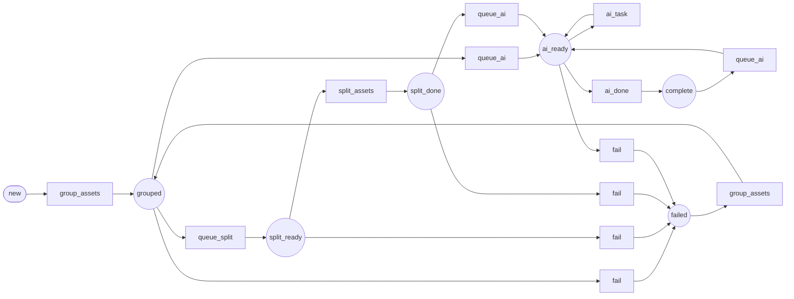

Workflow: media_record
======================

*Generated by `doc:workflows` on `2026-08-17T18:12:07+00:00`. Type: workflow.*

Diagram
-------



[High-resolution SVG](media_record.svg)

Places
------

* `new` *(initial)* — Record created and awaiting linked assets
* `grouped` — Assets associated to the record
* `split_ready` — Split requested for compound payloads (e.g. PDF)
* `split_done` — Child assets generated from compound source
* `ai_ready` — Record-level AI task queue active
* `complete` — Record processing complete
* `failed` — Terminal or retriable failure

Transitions
-----------

|Transition|From|To|
|:-|:-|:-|
|`group_assets`|`new`|`grouped`|
|`group_assets`|`failed`|`grouped`|
|`queue_split`|`grouped`|`split_ready`|
|`split_assets`|`split_ready`|`split_done`|
|`queue_ai`|`grouped`|`ai_ready`|
|`queue_ai`|`split_done`|`ai_ready`|
|`queue_ai`|`complete`|`ai_ready`|
|`ai_task`|`ai_ready`|`ai_ready`|
|`ai_done`|`ai_ready`|`complete`|
|`fail`|`grouped`|`failed`|
|`fail`|`split_ready`|`failed`|
|`fail`|`split_done`|`failed`|
|`fail`|`ai_ready`|`failed`|

Listeners
---------

*App listeners subscribed to this workflow's events, with source.*

### `App\Workflow\MediaRecordWorkflow::onAiTask()`

Events: `workflow.media_record.transition.ai_task`

`src/Workflow/MediaRecordWorkflow.php` (L35–L58)

```php
public function onAiTask(TransitionEvent $event): void
{
    $record = $this->getRecord($event);
    $nextTask = array_shift($record->aiQueue);
    if (!is_string($nextTask) || $nextTask === '') {
        return;
    }
    $record->aiCompleted[] = [
        'task' => $nextTask,
        'at' => (new \DateTimeImmutable())->format(DATE_ATOM),
        'result' => [
            'status' => 'queued',
            'note' => 'MediaRecord AI workflow scaffolded; task execution to be implemented.',
        ],
    ];
    $this->logger->info('MediaRecord AI task scaffold processed for {id}: {task}', [
        'id' => $record->id,
        'task' => $nextTask,
    ]);
    $this->entityManager->flush();
}
```

### `App\Workflow\MediaRecordWorkflow::onSplitAssets()`

Events: `workflow.media_record.transition.split_assets`

`src/Workflow/MediaRecordWorkflow.php` (L22–L32)

```php
public function onSplitAssets(TransitionEvent $event): void
{
    $record = $this->getRecord($event);
    $record->context ??= [];
    $record->context['split'] = [
        'status' => 'queued',
        'at' => (new \DateTimeImmutable())->format(DATE_ATOM),
        'note' => 'Split workflow scaffolded; implement PDF/page extraction next.',
    ];
    $this->entityManager->flush();
}
```